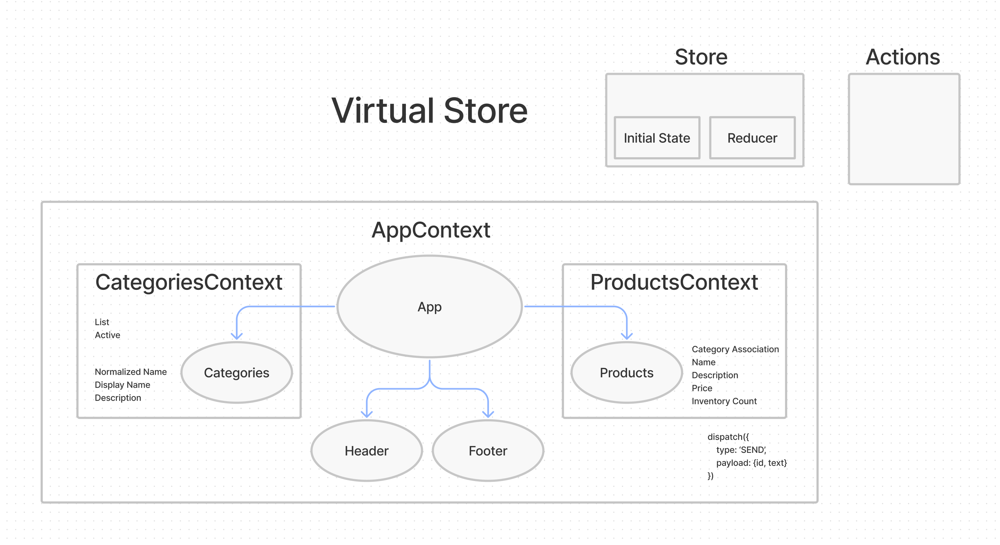

# Application State with Redux

Author: Ryan Emmans

## Summary of Problem Domain

### Virtual Store

Phase 1: For this assignment, you will be starting the process of creating an e-Commerce storefront using React with Redux, coupled with your live API server.

Phase 2: Continue work on the e-Commerce storefront, breaking up the store into multiple reducers and sharing functionality/data between components

### **Phase 1 Requirements**

Setup the basic scaffolding of the application with initial styling and basic behaviors. This initial build sets up the file structure and state management so that we can progressively build this application in a scalable manner

- As a user, I expect to see a list of available product categories in the store so that I can easily browse products.
- As a user, I want to choose a category and see a list of all available products matching that category.
- As a user, I want a clean, easy to use user interface so that I can shop the online store with confidence.

### **Phase 2 Requirements**

In phase 2, we will be adding the “Add to Cart” feature to our application, which will allow our users to not only browse items in the store, but also select them and have them persist in their “shopping cart” for later purchase.

- As a user, I want to choose from products in the list and add them to my shopping cart
- As a user, I want to see the products that I’ve added to my shopping cart so that
- As a user, I want to change the quantity of items I intend to purchase in my shopping cart
- As a user, I want to be able to remove an item from my shopping cart

### Application Flow:

User sees a list of categories

- … Chooses a category and sees a list of products
- … Clicks the “Add to Cart” button on any product
- … Clicks the “Cart” link in the header
- … Sees a list of all products in the cart
- … Clicks the delete button on an item and sees the item removed
- … Changes the quantity selector on an item and sees the cart total change

## Links to application deployment

  
[GitHub Actions](https://github.com/ryanemmans/storefront/actions)  
[Pull Requests](https://github.com/ryanemmans/storefront/pulls?q=is%3Apr+is%3Aclosed)

## UML

## Technical Requirements / Notes

- Create a visually appealing site using Material UI
- Use a Redux Store to manage the state of categories and items in the store
- Display a list of categories from state
- When the user selects (clicks on) a category …
  - Identify that category as selected (change of class/display)
  - Show a list of products associated with the category
- Add a “Cart” indicator to the header, like this: Cart (0)
- Create a new Cart component to show the items in the user’s cart

### Constructing Redux Store

- Categories
  - State should contain a list of categories as well as the active category
    - Each category should have a normalized name, display name, and a description
  - Create an action that will trigger the reducer to change the active category
  - Update the active category in the reducer when this action is dispatched
- Products
  - State should be a list of all products
    - Each product should have a category association, name, description, price, inventory count
  - Create an action that will trigger when the active category is changed
    - HINT: Multiple reducers can respond to the same actions
  - Create a reducer that will filter the products list based on the active category
- Active Category
  - State should store active category
    - Other components (products, etc) might need to reference this
